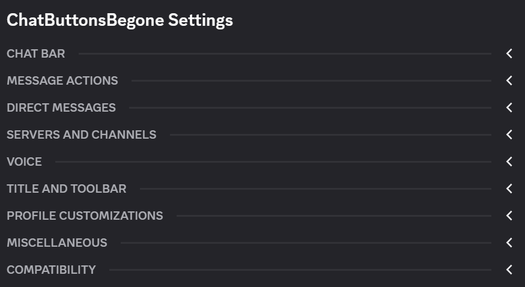

# Chat Buttons Begone!
Are you tired of all the needless clutter scattered around your client?

Well look no further!

From removing buttons on the Chat Bar, to the buttons/features no one ever uses, *or asked for*, Chat Buttons Begone has you covered!

Why manage custom CSS that gets broken every update? Chat Buttons Begone leverages the BdApi to ensure class compatibility between updates for you!

With over 70 settings, you can configure your client to remove or keep exactly what you want to, and make Discord your own.

This plugin is based on the work of, and expands upon, [QbDesu](https://github.com/QbDesu)'s [RemoveChatButtons](https://github.com/BleedingBD/plugin-RemoveChatButtons) plugin.

## Changelog
See [CHANGELOG.md](./CHANGELOG.md) for details on version history.

## Special Thanks
Special thanks to the following people:
- [Zacam](https://github.com/Zacam) for their work in a variety of ways for this plugin
- [MisansProducts](https://github.com/MisansProducts)